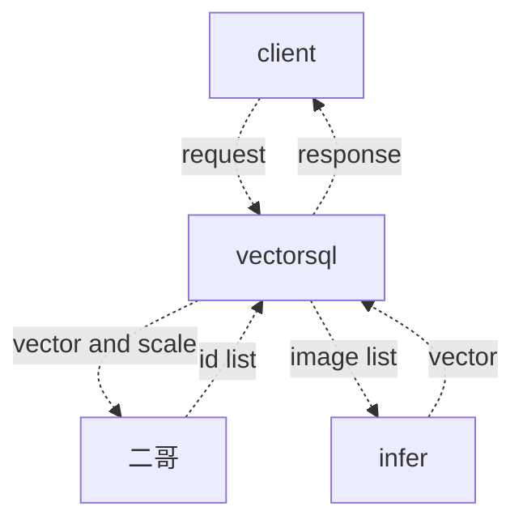

# vectorsql

## vectorsql支持的sql语法


vectorsql仅仅支持select-stmt，一个典型的查询如下:

```sql
select name from A where area = '上海' top 5
```

## 关系

vectorsql提供一个统一的关系抽象，每个关系都有一个唯一的id，每个关系包括两个子关系[^子关系继承父关系的名字]，item和event，item和event的属性数目不定，同时也可以任意增减。

限制: item关系的第一个属性名必须为seq，类型为uint64，event的第一个属性必须为seq, 类型为uint64，第二个属性名必须为id，类型为uint64。

### 类型

vectorsql支持以下类型

* uint8
* uint16
* uint32
* uint64
* int8
* int16
* int32
* int64
* float32
* float64
* datetime
* string

## http 关系创建接口

vectorsql通过http创建关系，创建的报文格式如下:

```json
POST /create
{
    "name":"user",
    "item":[
        {
            "name":"seq",
            "type":"uint64"
        },
        {
            "name":"name",
            "type":"string"
        }],
    "event":[
        {
            "name":"seq",
            "type":"uint64"
        },
        {
            "name":"id",
            "type":"uint64"
        },
        {
            "name":"name",
            "type":"string"
        }] 
}
```


## http查询接口

vectorsql通过http查询，查询接口的报文如下:

```http
Content-Type: multipart/form-data; boundary=--------

-------
Content-Disposition: form-data
Content-Type: json
{"query": "select name from user where area = '上海' top 5"}

----
Content-Disposition: form-data
Content-Type: image/png
image data

----
Content-Disposition: form-data
Content-Type: image/png
image data
```

### 查询返回值

```http
usr data
Content-Type: multipart/form-data; boundary=--------

-------
Content-Disposition: form-data
Content-Type: json
user data

----
Content-Disposition: form-data
Content-Type: image/png
image url

----
Content-Disposition: form-data
Content-Type: image/png
image data
```

## http上传接口

vectorsql通过http上传，上传接口的报文如下:

```http
Content-Type: multipart/form-data; boundary=--------

-------
Content-Disposition: form-data
Content-Type: json
{"id": "0", "method": "append"}

----
Content-Disposition: form-data
Content-Type: image/png
image data

-------
Content-Disposition: form-data
Content-Type: json
{"id": "0", "index": 0, method": "update"}

----
Content-Disposition: form-data
Content-Type: image/png
image data
```

## 处理流程



