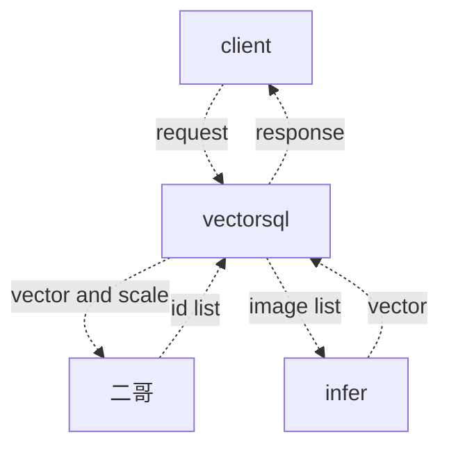

# vectorsql

## vectorsql支持的sql语法


vectorsql仅仅支持select-stmt，一个典型的查询如下:

```sql
select name from A where area = '上海' top 5 by vec
```

sql的grammer如下:

## http查询接口

vectorsql通过http查询，查询接口的报文如下:

```http
Content-Type: multipart/form-data; boundary=--------

-------
Content-Disposition: form-data
Content-Type: json
{"query": "select name from A where area = '上海' top 5 by vec"}

----
Content-Disposition: form-data
Content-Type: image/png
image data

----
Content-Disposition: form-data
Content-Type: image/png
image data
```


## http上传接口

vectorsql通过http上传，上传接口的报文如下:

```http
Content-Type: multipart/form-data; boundary=--------

-------
Content-Disposition: form-data
Content-Type: json
{"id": "0", "method": "append"}

----
Content-Disposition: form-data
Content-Type: image/png
image data

-------
Content-Disposition: form-data
Content-Type: json
{"id": "0", "index": 0, method": "update"}

----
Content-Disposition: form-data
Content-Type: image/png
image data
```

## 处理流程



